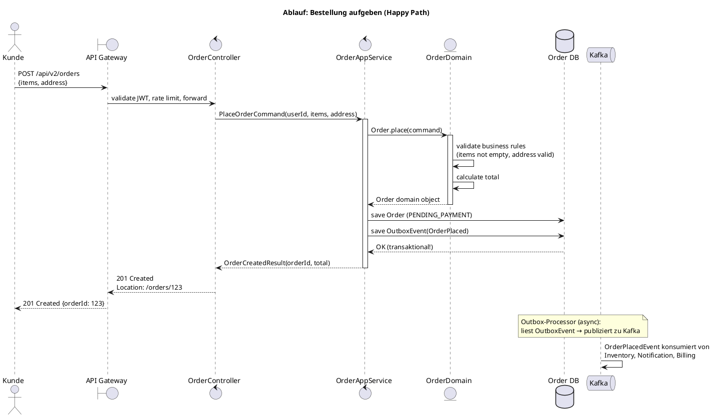
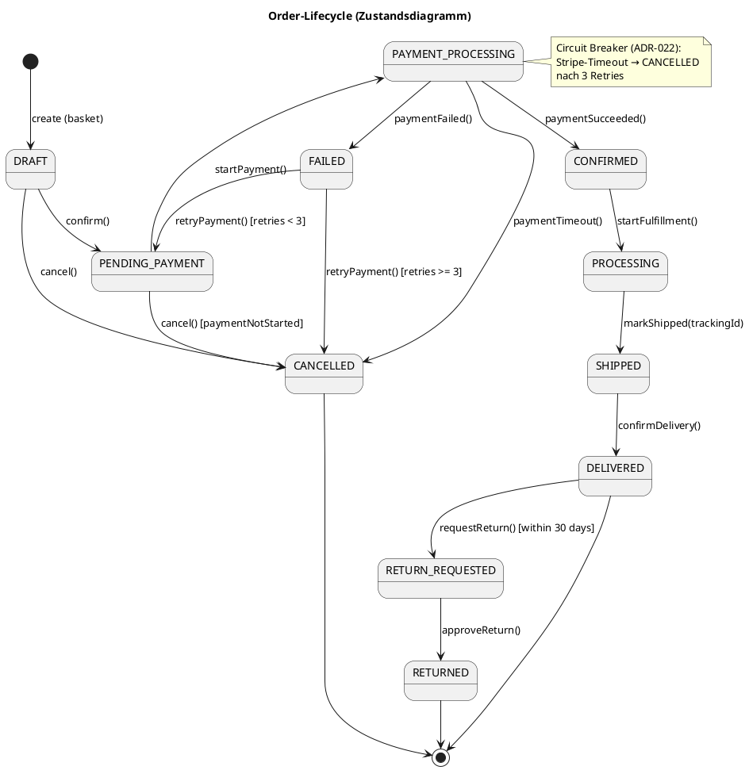

# ADR-088 — iSAQB F7: Werkzeuge für Softwarearchitekten — arc42, C4, UML

| Feld              | Wert                                                          |
|-------------------|---------------------------------------------------------------|
| Status            | ✅ Akzeptiert                                                 |
| Entscheider       | Architektur-Board                                             |
| Datum             | 2024-01-01                                                    |
| Review-Datum      | 2025-01-01                                                    |
| Kategorie         | iSAQB Foundation F7 · Dokumentationswerkzeuge                |
| Betroffene Teams  | Tech Leads, alle Entwickler                                   |
| iSAQB-Lernziel    | LZ-7-1 bis LZ-7-6 (Foundation Level)                         |

---

## 1. Das Problem mit Architekturdokumentation

```
BEOBACHTUNG IN DER PRAXIS:
  ① Zu viel Dokumentation: niemand liest 200-seitige Word-Dokumente
  ② Zu wenig Dokumentation: Neulinge brauchen 3 Monate Einarbeitung
  ③ Veraltete Dokumentation: schlimmer als keine — sie lügt
  ④ Falscher Detailgrad: C++-Klassen in einem High-Level-Überblick

DIE LÖSUNG:
  Dokumentation muss:
  ① Lesergerecht strukturiert sein (verschiedene Stakeholder)
  ② Als Code gepflegt werden können (→ kein Word-Dokument)
  ③ Den richtigen Abstraktionsgrad haben (C4-Levels)
  ④ Wartbar sein durch Automatisierung
```

---

## 2. arc42: Das Architektur-Dokumentations-Template

### 2.1 Was arc42 ist

arc42 (Peter Hruschka & Gernot Starke) ist ein Template für Architekturdokumentation mit 12 Kapiteln. Es beantwortet Fragen die Stakeholder wirklich stellen — statt Fragen die Architekten interessant finden.

### 2.2 Die 12 Kapitel mit Fokus auf das Wesentliche

```
Kapitel 1: Einführung und Ziele
  WAS: Fachliche Anforderungen, Qualitätsziele, Stakeholder
  WARUM: Jeder Leser braucht Kontext bevor er Details versteht
  BEISPIEL:
    "Der Order-Service verwaltet den Bestelllebenszyklus von der Bestellung
     bis zur Auslieferung. Primäre Qualitätsziele: Performance (P95 < 500ms),
     Verfügbarkeit (99.9%), Wartbarkeit (< 5 PT für neue Zahlungsmethode)."

Kapitel 2: Randbedingungen
  WAS: Technische und organisatorische Constraints
  WARUM: Erklärt warum manche Entscheidungen nicht anders möglich waren
  BEISPIEL:
    "Technisch: Java 21, PostgreSQL (Unternehmensstandard, kein Wechsel möglich),
     Kubernetes (Betrieb durch Platform-Team)
     Organisatorisch: Team 6 Personen, 2 Sprints für MVP"

Kapitel 3: Kontextabgrenzung
  WAS: Systemgrenzen — was ist innen, was außen?
  WERKZEUG: C4 Level 1 (System Context Diagram)
  BEISPIEL:
    Zeigt: Order-Service ↔ Nutzer, Stripe, Inventory, Notification
    Klärt: Welche Systeme sind unsere Verantwortung, welche nicht?

Kapitel 4: Lösungsstrategie
  WAS: Die wichtigsten Architekturentscheidungen (Kern-ADRs)
  WARUM: Warum diese Entscheidungen? Welche Alternativen wurden verworfen?
  BEISPIEL:
    "Hexagonale Architektur (→ ADR-031): Domäne framework-unabhängig.
     Spring Modulith (→ ADR-079): Modulgrenzen maschinell erzwungen.
     Asynchrone Kafka-Kommunikation (→ ADR-041): Entkopplung der Domänen."

Kapitel 5: Bausteinsicht
  WAS: Statische Struktur des Systems (C4 Level 2+3)
  WERKZEUG: Komponentendiagramm, Paketdiagramm

Kapitel 6: Laufzeitsicht
  WAS: Wichtige Ablaufszenarien (Sequenzdiagramme)
  BEISPIEL: "Wie läuft eine Bestellung durch das System?"
  WERKZEUG: Sequenzdiagramm, Aktivitätsdiagramm

Kapitel 7: Verteilungssicht
  WAS: Deployment-Infrastruktur (C4 Level 4 / Deployment)
  BEISPIEL: Kubernetes-Cluster, Pods, externe Services

Kapitel 8: Querschnittskonzepte
  WAS: Übergreifende Konzepte (→ ADR-086)
  BEISPIEL: Logging-Strategie, Fehlerbehandlung, Transaktionsmanagement

Kapitel 9: Architekturentscheidungen
  WAS: ADR-Verweise oder ADR-Inhalte
  HINWEIS: In diesem Kompendium: Verweis auf ADRs, kein Duplizieren

Kapitel 10: Qualitätsanforderungen
  WAS: Qualitätsbaum + Szenarien (→ ADR-082)
  WERKZEUG: ISO 25010 Qualitätsbaum, Szenario-Tabellen

Kapitel 11: Risiken und technische Schulden
  WAS: Bekannte Risiken, dokumentierte Schulden (→ ADR-051)

Kapitel 12: Glossar
  WAS: Domänenbegriffe, Abkürzungen, fachliches Vokabular
```

### 2.3 arc42 als Markdown (Docs-as-Code)

```markdown
<!-- docs/architecture/README.md — arc42 in Markdown -->

# Architektur: Order Service

## 1. Einführung und Ziele

### Fachliche Anforderungen (Top 3)
1. Bestellungen aufgeben, verfolgen, stornieren
2. Zahlungsabwicklung (Stripe) mit Fallback
3. Benachrichtigungen bei Statusänderungen

### Qualitätsziele (priorisiert)
| Prio | Qualitätsziel | Szenario |
|------|---------------|----------|
| 1    | Verfügbarkeit | 99.9% uptime, kein Ausfall bei Stripe-Downtime |
| 2    | Performance   | P95 < 500ms bei 100 RPS |
| 3    | Wartbarkeit   | Neue Zahlungsmethode < 5 PT |

### Stakeholder
| Rolle | Interesse |
|-------|-----------|
| Produktmanager | Feature-Lieferung, Time-to-Market |
| Betrieb/DevOps | Stabile Deployments, gute Observability |
| Entwickler | Klare Grenzen, schnelle Tests |
| Kunde (indirekt) | Schnelle, zuverlässige Bestellabwicklung |

## 3. Kontextabgrenzung

```plantuml
@startuml context
!include C4Context.puml
Person(customer, "Kunde", "Kauft Produkte")
System(orderService, "Order Service", "Bestellverwaltung")
System_Ext(stripe, "Stripe", "Zahlungen")
System_Ext(inventory, "Inventory Service", "Lagerbestand")
Rel(customer, orderService, "Bestellt", "HTTPS")
Rel(orderService, stripe, "Zahlung", "HTTPS")
Rel(orderService, inventory, "Bestand prüfen", "Events/Kafka")
@enduml
```
```

---

## 3. C4-Modell: Vier Abstraktionsebenen

### 3.1 C4 Level 1 — System Context

```plantuml
@startuml C4_Level1
!include https://raw.githubusercontent.com/plantuml-stdlib/C4-PlantUML/master/C4_Context.puml

LAYOUT_WITH_LEGEND()

title Level 1: System Context — E-Commerce Platform

Person(customer,  "Kunde",          "Kauft Produkte online")
Person(admin,     "Admin",          "Verwaltet Katalog und Orders")

System(ecommerce, "E-Commerce Platform",
    "Bestellverwaltung, Zahlungen, Benachrichtigungen")

System_Ext(stripe,   "Stripe",          "Zahlungsabwicklung")
System_Ext(sendgrid, "SendGrid",        "E-Mail-Versand")
System_Ext(erp,      "ERP-System",      "Lagerverwaltung (Legacy)")

Rel(customer,  ecommerce, "Bestellt, verfolgt",          "HTTPS")
Rel(admin,     ecommerce, "Verwaltet",                    "HTTPS")
Rel(ecommerce, stripe,    "Verarbeitet Zahlungen",        "HTTPS/REST")
Rel(ecommerce, sendgrid,  "Sendet E-Mails",               "HTTPS/REST")
Rel(ecommerce, erp,       "Synchronisiert Lagerbestand",  "Kafka")

@enduml
```

### 3.2 C4 Level 2 — Container

```plantuml
@startuml C4_Level2
!include C4_Container.puml

title Level 2: Container — E-Commerce Platform

Person(customer, "Kunde")

Container_Boundary(ecommerce, "E-Commerce Platform") {
    Container(spa,          "React SPA",         "TypeScript/React",  "Benutzeroberfläche")
    Container(gateway,      "API Gateway",        "Spring Cloud GW",   "Routing, Rate Limiting, Auth")
    Container(orderSvc,     "Order Service",      "Java 21/Spring",    "Bestelllogik")
    Container(inventorySvc, "Inventory Service",  "Java 21/Spring",    "Lagerbestand")
    Container(notifySvc,    "Notification Svc",   "Java 21/Spring",    "E-Mail, Push")
    ContainerDb(orderDb,    "Order DB",           "PostgreSQL 16",     "Bestelldaten")
    Container(kafka,        "Event Bus",          "Apache Kafka 3.x",  "Async-Kommunikation")
}

System_Ext(stripe,   "Stripe")
System_Ext(sendgrid, "SendGrid")

Rel(customer,   spa,         "HTTPS")
Rel(spa,        gateway,     "REST/HTTPS")
Rel(gateway,    orderSvc,    "REST/HTTPS")
Rel(gateway,    inventorySvc,"REST/HTTPS")
Rel(orderSvc,   orderDb,     "SQL/JDBC")
Rel(orderSvc,   kafka,       "Publiziert Events")
Rel(notifySvc,  kafka,       "Konsumiert Events")
Rel(orderSvc,   stripe,      "HTTPS")
Rel(notifySvc,  sendgrid,    "HTTPS")

@enduml
```

### 3.3 C4 Level 3 — Component (Order Service intern)

```plantuml
@startuml C4_Level3
!include C4_Component.puml

title Level 3: Components — Order Service

Container_Boundary(orderSvc, "Order Service") {
    Component(ctrl,      "OrderController",      "Spring MVC",     "REST-API-Endpunkte")
    Component(appSvc,    "OrderAppService",       "Spring Service", "Use-Case-Orchestrierung")
    Component(domain,    "Order Domain",          "Plain Java",     "Business-Regeln, Aggregate")
    Component(repo,      "OrderJpaRepository",    "Spring Data JPA","Persistenz-Adapter")
    Component(stripe,    "StripePaymentAdapter",  "Resilience4j",   "Zahlungs-Adapter")
    Component(outbox,    "OutboxEventPublisher",  "Transaktional",  "Event-Veröffentlichung")
}

ContainerDb(orderDb, "Order DB", "PostgreSQL")
Container(kafka,     "Kafka",    "Event Bus")
System_Ext(stripeApi,"Stripe API")

Rel(ctrl,   appSvc, "Ruft auf")
Rel(appSvc, domain, "Delegiert an")
Rel(domain, repo,   "über Port")
Rel(domain, stripe, "über Port")
Rel(domain, outbox, "publiziert")
Rel(repo,   orderDb,"SQL")
Rel(stripe, stripeApi,"HTTPS")
Rel(outbox, orderDb, "Transaktional")
Rel(outbox, kafka,   "nach Commit")

@enduml
```

---

## 4. UML: Welche Diagrammtypen wann

```
STRUKTURDIAGRAMME (statisch — "Was gibt es?"):
  Klassendiagramm:     Klassen, Interfaces, Beziehungen
                       Wann: Domain-Modell erklären, Abhängigkeiten zeigen
  Komponentendiagramm: Module, Komponenten, Schnittstellen
                       Wann: Architektur-Ebene (C4 Level 2/3)
  Paketdiagramm:       Pakete und ihre Abhängigkeiten
                       Wann: Schichtenarchitektur visualisieren

VERHALTENSDIAGRAMME (dynamisch — "Was passiert?"):
  Sequenzdiagramm:     Nachrichten zwischen Objekten in zeitlicher Reihenfolge
                       Wann: API-Interaktion, Bestellablauf, Event-Flow
  Aktivitätsdiagramm:  Ablauflogik, Entscheidungen, parallele Flows
                       Wann: Business-Prozesse, Algorithmen
  Zustandsdiagramm:    Zustände eines Objekts und Übergänge
                       Wann: Order-Status-Maschine, Bezahlstatus

FAUSTREGEL (iSAQB):
  So wenig UML wie nötig. Text + UML > nur UML > nur Text.
  Nie UML um UML zu machen.
  Immer fragen: "Wer liest das und was will er wissen?"
```

### 4.1 Sequenzdiagramm: Bestellablauf



### 4.2 Zustandsdiagramm: Order-Lifecycle



---

## 5. Docs-as-Code: Dokumentation im Repository

### 5.1 Warum Dokumentation im Git-Repository lebt

```
PROBLEM mit Word/Confluence:
  ① Nicht versioniert (wer hat wann was geändert?)
  ② Kein Review-Prozess (PR → Review → Merge)
  ③ Entkoppelt vom Code (veraltet sofort nach Code-Änderung)
  ④ Kein "Broken Link Detection" (veraltete Querverweise)

LÖSUNG: Docs-as-Code
  ① Markdown im Repository → Git-History = Dokumentations-History
  ② Diagramme als Code (PlantUML, Mermaid) → versioniert, reviewbar
  ③ CI/CD rendert automatisch (GitHub Pages, Confluence-Publisher)
  ④ Links zwischen Docs werden in CI geprüft (broken-link-checker)
```

### 5.2 Projektstruktur für Architekturdokumentation

```
docs/
├── architecture/
│   ├── README.md                    ← arc42-Template (Einstiegspunkt)
│   ├── adr/                         ← Architecture Decision Records
│   │   ├── ADR-001-records.md
│   │   └── ...
│   ├── diagrams/
│   │   ├── context.puml             ← C4 Level 1
│   │   ├── containers.puml          ← C4 Level 2
│   │   ├── components-orders.puml   ← C4 Level 3
│   │   ├── sequence-order-place.puml← Sequenzdiagramm
│   │   └── state-order.puml        ← Zustandsdiagramm
│   ├── quality-scenarios.yml        ← Qualitätsszenarien (→ ADR-082)
│   └── utility-tree.md              ← ATAM Utility Tree (→ ADR-087)
├── teams/
│   ├── orders-team/
│   │   └── README.md               ← Team API (→ ADR-085)
│   └── platform-team/
│       └── README.md
└── runbooks/                        ← Betriebsdokumentation
    ├── high-error-rate.md
    └── service-down.md
```

### 5.3 CI-Pipeline für Dokumentation

```yaml
# .gitlab-ci.yml — Dokumentation automatisch rendern und deployen

docs:render-diagrams:
  stage: build
  image: plantuml/plantuml:latest
  script:
    # PlantUML-Diagramme zu PNG/SVG rendern
    - find docs/architecture/diagrams -name "*.puml" -exec
        java -jar /opt/plantuml.jar -tsvg {} \;
  artifacts:
    paths: [docs/architecture/diagrams/**/*.svg]

docs:check-links:
  stage: test
  image: node:20-alpine
  script:
    - npm install -g markdown-link-check
    - find docs -name "*.md" -exec markdown-link-check {} \;
  # Schlägt fehl bei toten Links → Dokumentationsqualität sichergestellt

docs:publish:
  stage: deploy
  script:
    # Zu GitLab Pages oder Confluence deployen
    - mkdocs build
    - mkdocs gh-deploy
  rules:
    - if: '$CI_COMMIT_BRANCH == "main"'
```

---

## 6. Structurizr DSL: Architektur als ausführbarer Code

```kotlin
// workspace.dsl — Structurizr DSL als lesbarstes Architektur-Code-Format
workspace "E-Commerce" "Aktuelle Systemarchitektur" {

    model {
        customer = person "Kunde" "Kauft Produkte"

        ecommerce = softwareSystem "E-Commerce" {

            orderService = container "Order Service" "Java 21 / Spring Boot" {
                tags "Service"

                // C4 Level 3: Komponenten
                orderCtrl   = component "OrderController" "Spring MVC"
                orderDomain = component "Order Domain"    "Plain Java"
                stripeAdptr = component "StripeAdapter"   "Resilience4j"

                // ADR-Verweise als Properties
                orderDomain -> orderCtrl {
                    properties {
                        "adr" "ADR-031 (Hexagonal), ADR-023 (DDD)"
                    }
                }
            }
        }

        // Beziehungen
        customer -> orderService "Bestellt" "HTTPS"
    }

    views {
        // Automatisch generierte C4-Diagramme für alle Ebenen
        systemContext ecommerce { include * ; autoLayout }
        container    ecommerce { include * ; autoLayout }
        component    orderService { include * ; autoLayout }

        styles {
            element "Service"  { shape RoundedBox ; background "#1168BD" ; color "#ffffff" }
            element "Database" { shape Cylinder }
        }
    }
}
```

---

## 7. Antipatterns in der Architekturdokumentation

```
ANTIPATTERN 1: "Architecture Astronaut"
  Symptom: 80-seitige Architekturdoku, die niemand liest
  Ursache: Dokumentation für die Dokumentation
  Lösung: arc42 Kapitel 1-3 zuerst; Leser fragen was sie brauchen

ANTIPATTERN 2: "Screenshot Architecture"
  Symptom: Architektur-Diagramme als Bilder eingefügt (nicht als Code)
  Ursache: Visio, PowerPoint als Diagrammwerkzeug
  Konsequenz: Kein Diff möglich, veraltet sofort, kein CI-Rendering
  Lösung: PlantUML, Mermaid, Structurizr DSL — alles als Textdatei

ANTIPATTERN 3: "Living in the Past"
  Symptom: Dokumentation zeigt die Architektur von vor 2 Jahren
  Ursache: Dokumentation und Code leben getrennt
  Konsequenz: Misleading — neue Entwickler lernen falsche Architektur
  Lösung: Docs-as-Code + CI der fehlende Querverweise findet

ANTIPATTERN 4: "One-Size-Fits-All"
  Symptom: Alle Stakeholder bekommen dasselbe Dokument
  Ursache: Kein Bewusstsein für verschiedene Informationsbedürfnisse
  Konsequenz: Management versteht nicht, Entwickler vermissen Details
  Lösung: C4-Abstraktionsniveaus + arc42-Kapitel gezielt für Stakeholder
```

---

## 8. Quellen & Referenzen

- **iSAQB CPSA-F Curriculum (2023), LZ-7-1 bis LZ-7-6** — Dokumentationswerkzeuge als Pflicht im Foundation Level.
- **Simon Brown, "The C4 Model for Visualising Software Architecture" (2018)** — Vier Abstraktionsebenen als pragmatischer Mittelweg zwischen UML-Komplexität und Sketch-Ungenauigkeit.
- **Peter Hruschka & Gernot Starke, arc42 Template (2005–2023)** — Deutschen Standard für Architekturdokumentation; kostenlos unter arc42.org.
- **Cyrille Martraire, "Living Documentation" (2019)** — Dokumentation aus Code generieren; Docs-as-Code als Profession.
- **Martin Fowler, "Who Needs an Architect?" (2003), IEEE Software** — "Architecturally significant" als Kriterium welche Entscheidungen dokumentiert werden müssen.

---

## Akzeptanzkriterien

- [ ] arc42-Dokumentation in `docs/architecture/README.md` existiert mit mind. Kapiteln 1, 3, 4, 5
- [ ] C4-Diagramme Level 1 und Level 2 existieren als PlantUML-Dateien (nicht als Bilder!)
- [ ] CI rendert Diagramme automatisch und prüft Links
- [ ] Sequenzdiagramm für den wichtigsten Use Case (Bestellung aufgeben) vorhanden
- [ ] Zustandsdiagramm für Order-Lifecycle vorhanden
- [ ] Neue Entwickler können nach 1 Tag Onboarding mit der Dokumentation arbeiten (gemessen durch Feedback)

---

## Verwandte ADRs

- [ADR-047](ADR-047-c4-architekturdokumentation.md) — C4-Modell mit Structurizr DSL vollständig
- [ADR-087](ADR-087-isaqb-architekturbewertung.md) — Bewertungsergebnisse in arc42 dokumentieren
- [ADR-089](ADR-089-isaqb-advanced-context-mapping.md) — Advanced Level: Context Mapping als nächste Ebene
