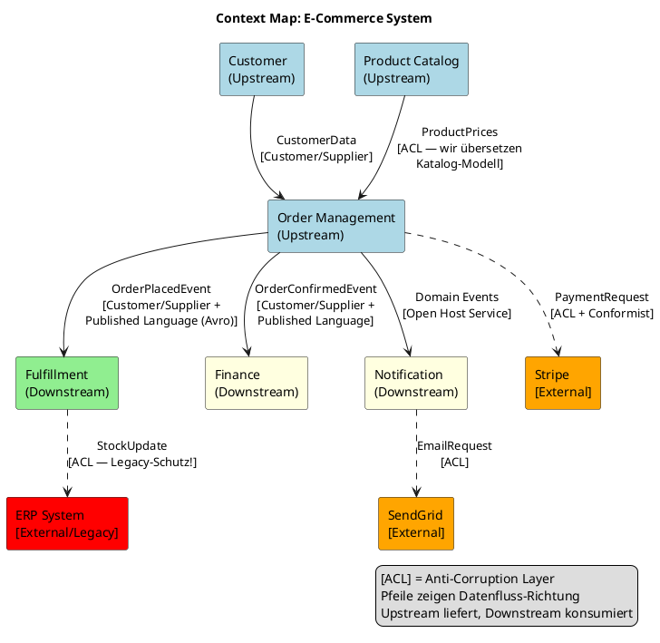

# ADR-089 — iSAQB Advanced: Context Mapping, Anti-Corruption Layer & Strategic DDD

| Feld              | Wert                                                          |
|-------------------|---------------------------------------------------------------|
| Status            | ✅ Akzeptiert                                                 |
| Entscheider       | CTO / Architektur-Board                                       |
| Datum             | 2024-01-01                                                    |
| Review-Datum      | 2025-01-01                                                    |
| Kategorie         | iSAQB Advanced · Strategic DDD · Context Mapping             |
| Betroffene Teams  | Tech Leads, alle Teams                                        |
| iSAQB-Lernziel    | Advanced Level · Strategic Design                             |

---

## 1. Warum Strategic DDD über Taktisches DDD hinausgeht

```
TAKTISCHES DDD (Micro-Design, → ADR-023):
  Aggregate, Entities, Value Objects, Domain Events, Repositories
  → "Wie designe ich INNERHALB einer Domäne?"
  → Fokus: Klassen-Ebene, ein Bounded Context

STRATEGISCHES DDD (Macro-Design — dieser ADR):
  Bounded Contexts, Context Mapping, Ubiquitous Language je Kontext
  → "Wie teile ich das GESAMTSYSTEM in Domänen auf?"
  → "Wie integrieren Domänen miteinander?"
  → Fokus: System-Ebene, viele Bounded Contexts

WARUM STRATEGIC DDD ENTSCHEIDEND IST:
  Ein falsch geschnittener Bounded Context kostet mehr als alle
  taktischen DDD-Fehler zusammen. Falsche Grenzen = Distributed Monolith.
  Richtige Grenzen = autonome Teams + evolutionäre Architektur.
```

---

## 2. Bounded Contexts: Die Grundeinheit des strategischen Designs

### 2.1 Das Linguistik-Problem in großen Systemen

```
"ORDER" bedeutet in verschiedenen Kontexten etwas Verschiedenes:

Im Bestellkontext (Order Management):
  Order = {items, shippingAddress, paymentMethod, status: PENDING→SHIPPED}
  Interessiert: Welche Artikel, wohin, wie bezahlen?

Im Versandkontext (Fulfillment):
  Order = {trackingId, warehouse, weight, dimensions, carrier}
  Interessiert: Was muss physisch versendet werden?

Im Buchhaltungskontext (Finance):
  Order = {invoiceNumber, taxRate, netAmount, vatAmount, costCenter}
  Interessiert: Wie wird verbucht?

Im Kundenservice-Kontext (Support):
  Order = {customerId, complaintStatus, refundEligible, history}
  Interessiert: Hat der Kunde ein Problem?

KONSEQUENZ:
  Wenn alle Kontexte dasselbe Order-Objekt teilen:
  → Riesige, unhandliche Klasse mit 40 Feldern
  → Jeder Kontext benutzt nur 10 der 40 Felder
  → Feld "weight" macht keinen Sinn im Finance-Kontext
  → Änderung für Versand bricht Finance-Code

  Wenn jeder Kontext sein eigenes Order-Modell hat:
  → Jedes Modell ist klein, kohäsiv, verständlich
  → Unabhängige Entwicklung und Deployment
  → Namensgebung macht im Kontext Sinn
```

### 2.2 Bounded Context Definition und Abgrenzung

```java
// Jeder Bounded Context hat seine eigene Ubiquitous Language
// UND sein eigenes Domänenmodell

// ORDER MANAGEMENT CONTEXT:
package com.example.orders.domain;

public class Order {                     // Order IM Order-Kontext
    private OrderId id;
    private CustomerId customerId;
    private List<OrderItem> items;       // Artikel + Preis + Menge
    private ShippingAddress address;
    private PaymentMethod paymentMethod;
    private OrderStatus status;          // PENDING, CONFIRMED, CANCELLED...
    private Money total;
}

// FULFILLMENT CONTEXT — ANDERES Modell, anderes Vokabular:
package com.example.fulfillment.domain;

public class Shipment {                  // Heißt nicht "Order"!
    private ShipmentId id;
    private OrderReference orderRef;     // Nur Referenz auf Order-ID
    private List<ShipmentItem> items;    // Artikel + Gewicht + Abmessungen
    private Warehouse sourceWarehouse;
    private Carrier carrier;
    private TrackingNumber trackingNumber;
    private ShipmentStatus status;       // PREPARED, PICKED, SHIPPED, DELIVERED
    // KEIN paymentMethod, KEIN customerId — nicht relevant hier
}

// FINANCE CONTEXT:
package com.example.finance.domain;

public class Invoice {                   // Auch nicht "Order"
    private InvoiceNumber number;
    private OrderReference orderRef;
    private TaxableAmount netAmount;
    private VatRate vatRate;
    private Money vatAmount;
    private CostCenter costCenter;
    private AccountingPeriod period;
    // KEIN shippingAddress, KEIN carrier — nicht relevant hier
}
```

---

## 3. Context Map: Die Beziehungen zwischen Bounded Contexts

### 3.1 Context-Map-Pattern-Übersicht

```
Eric Evans definiert neun Integration-Pattern zwischen Bounded Contexts.
Die wichtigsten für unsere Architektur:

┌─────────────────────────────────────────────────────────────────────────┐
│                    CONTEXT MAP PATTERNS                                  │
├──────────────────────┬──────────────────────────────────────────────────┤
│ Partnership          │ Zwei Teams koordinieren eng, gemeinsamer Erfolg  │
│                      │ Selten: erfordert dauerhaften Koordinationsaufwand│
├──────────────────────┼──────────────────────────────────────────────────┤
│ Shared Kernel        │ Gemeinsamer Code-Kern, beide Teams pflegen ihn   │
│                      │ Vorsicht: erzeugt enge Kopplung                  │
├──────────────────────┼──────────────────────────────────────────────────┤
│ Customer/Supplier    │ Upstream liefert, Downstream konsumiert          │
│ (Upstream/Downstream)│ Downstream hat Einfluss auf Upstream-Roadmap     │
├──────────────────────┼──────────────────────────────────────────────────┤
│ Conformist           │ Downstream übernimmt Upstream-Modell komplett    │
│                      │ Wenn Upstream externe API (Stripe, AWS) ist      │
├──────────────────────┼──────────────────────────────────────────────────┤
│ Anti-Corruption      │ Downstream übersetzt Upstream-Modell (Schutzwall)│
│ Layer (ACL)          │ Schützt eigene Domäne vor externen Modellen      │
├──────────────────────┼──────────────────────────────────────────────────┤
│ Open Host Service    │ Upstream definiert offenes Protokoll/API         │
│ (OHS)                │ Viele verschiedene Downstream-Consumer möglich   │
├──────────────────────┼──────────────────────────────────────────────────┤
│ Published Language   │ Gemeinsames, dokumentiertes Austauschformat      │
│ (PL)                 │ Oft: OpenAPI-Schema, Avro-Schema, Protobuf        │
├──────────────────────┼──────────────────────────────────────────────────┤
│ Separate Ways        │ Keine Integration — Kontexte komplett unabhängig │
│                      │ Selten, nur wenn kein Mehrwert aus Integration    │
└──────────────────────┴──────────────────────────────────────────────────┘
```

### 3.2 Unsere konkrete Context Map



---

## 4. Anti-Corruption Layer: Der wichtigste Schutzwall

### 4.1 Warum ACL unverzichtbar ist

```
OHNE ACL: Stripe-Terminologie infiltriert unsere Domäne

// ❌ SCHLECHT — Stripe-Modell direkt im OrderService
@Service
public class OrderService {
    private final StripeClient stripe;

    public void processPayment(Order order) {
        // Stripe-Konzepte direkt in Domäne:
        var paymentIntent = stripe.paymentIntents.create(
            PaymentIntentCreateParams.builder()
                .setAmount(order.total().inCents())
                .setCurrency(order.currency().toLowerCase())
                .setPaymentMethod(order.stripePaymentMethodId()) // Stripe-ID in Domain!
                .setConfirmationMethod(PaymentIntentCreateParams.ConfirmationMethod.MANUAL)
                .build()
        );
        order.setStripePaymentIntentId(paymentIntent.getId()); // Stripe-ID in Domain!
        order.setStripeStatus(paymentIntent.getStatus());       // Stripe-Vokabular!
    }
}
// Problem:
// - Domain-Objekt Order kennt Stripe-IDs und Stripe-Status-Strings
// - PayPal einführen? Komplette Änderung aller Domain-Klassen
// - Tests brauchen Stripe-Mocks überall
// - "paymentMethodId" — Stripe-Begriff, nicht unser Begriff
```

```java
// ✅ GUT — Anti-Corruption Layer schützt die Domäne

// 1. Domäne definiert ihr eigenes Sprache (keine Stripe-Begriffe!)
package com.example.orders.domain.port.out;

public interface PaymentGateway {       // Unser Begriff, nicht "StripeClient"
    PaymentResult authorize(
        PaymentAuthorization authorization  // Unser Typ!
    );
    PaymentResult capture(PaymentReference reference);
    RefundResult refund(PaymentReference reference, Money amount);
}

public record PaymentAuthorization(
    Money amount,
    PaymentMethod method,        // Unser Enum: CREDIT_CARD, PAYPAL, SEPA
    CustomerId customerId
) {}

public record PaymentResult(
    PaymentReference reference,  // Unser Typ — kein Stripe-String!
    PaymentStatus status,        // Unser Enum: AUTHORIZED, DECLINED, PENDING
    Optional<String> failureReason
) {}

// 2. ACL: Übersetzt zwischen Domäne und Stripe
package com.example.orders.adapter.payment;

@Component
public class StripePaymentGateway implements PaymentGateway {
    private final StripeClient stripe;

    @Override
    public PaymentResult authorize(PaymentAuthorization auth) {
        // Übersetzung: Domäne → Stripe-API
        var stripeParams = PaymentIntentCreateParams.builder()
            .setAmount(auth.amount().toMinorUnit())           // unser Money → Stripe-Cents
            .setCurrency(auth.amount().currency().getCode())  // unser Currency → Stripe-String
            .setPaymentMethod(resolveStripeMethod(auth.method())) // unser Enum → Stripe-ID
            .build();

        try {
            var intent = stripe.paymentIntents().create(stripeParams);

            // Übersetzung: Stripe-API → Domäne
            return new PaymentResult(
                PaymentReference.from(intent.getId()),          // Stripe-ID → unser Typ
                translateStatus(intent.getStatus()),             // Stripe-String → unser Enum
                Optional.empty()
            );
        } catch (StripeException e) {
            // Stripe-Exception → Domänen-Exception (kein Stripe-Typ in Domain!)
            return new PaymentResult(
                PaymentReference.none(),
                PaymentStatus.DECLINED,
                Optional.of(e.getMessage())
            );
        }
    }

    // Übersetzungs-Methoden: vollständig gekapselt im Adapter
    private PaymentStatus translateStatus(String stripeStatus) {
        return switch (stripeStatus) {
            case "requires_capture" -> PaymentStatus.AUTHORIZED;
            case "succeeded"        -> PaymentStatus.CAPTURED;
            case "canceled"         -> PaymentStatus.CANCELLED;
            default                 -> PaymentStatus.PENDING;
        };
    }
}
```

### 4.2 ACL für Legacy-Systeme (besonders wichtig)

```java
// Legacy ERP-System: XML-basiert, proprietäre Datenstrukturen
// OHNE ACL wäre das XML-Modell überall in unserem Code

// ❌ OHNE ACL: Legacy-Datenstrukturen in moderner Codebasis
@Service
public class InventoryService {
    public StockLevel check(String articleNumber) {  // ERP: "articleNumber"
        var response = erpXmlClient.call(
            "<GetStock><ArticleNr>" + articleNumber + "</ArticleNr></GetStock>");
        // XML parsen, ERP-Fehlercodes behandeln...
        return parseErpXmlResponse(response);  // Direkte ERP-Abhängigkeit
    }
}

// ✅ MIT ACL: Legacy-Komplexität im Adapter gekapselt
package com.example.inventory.domain.port.out;

public interface StockRepository {  // Unser Interface, unsere Sprache
    StockLevel findByProduct(ProductId productId);
    void reserve(ProductId productId, Quantity quantity);
}

@Component
public class ErpStockAdapter implements StockRepository {
    private final ErpXmlClient erpClient;
    private final ProductIdToErpArticleMapper mapper;

    @Override
    public StockLevel findByProduct(ProductId productId) {
        // Übersetzung: unsere ProductId → ERP-ArtikelNummer
        var erpArticleNumber = mapper.toErpFormat(productId);

        // XML-Aufruf nur hier im Adapter
        var erpResponse = erpClient.call(buildXmlRequest(erpArticleNumber));

        // Übersetzung: ERP-XML → unser Domänentyp
        return parseErpResponse(erpResponse, productId);
    }

    private StockLevel parseErpResponse(String xml, ProductId productId) {
        // ERP-Eigenheiten hier kapseln:
        // ERP gibt "-1" zurück wenn Artikel unbekannt
        // ERP gibt "9999" zurück wenn Bestand nicht erfasst
        // Diese "Quirks" kennt nur dieser Adapter!
        var quantity = extractQuantity(xml);
        if (quantity == -1) return StockLevel.unknown(productId);
        if (quantity == 9999) return StockLevel.notTracked(productId);
        return StockLevel.of(productId, new Quantity(quantity));
    }
}
```

---

## 5. Context Integration: Events vs. direkte Aufrufe

### 5.1 Wann Events, wann direkte API-Aufrufe?

```
DIREKTE AUFRUFE (synchron, Customer/Supplier):
  Wann: sofortige Antwort notwendig, enge fachliche Kopplung OK
  Beispiel: Bestandsprüfung VOR Order-Anlage (must be consistent!)
  Kosten: temporale Kopplung, höhere Latenz, Availability-Abhängigkeit
  Technologie: REST (→ ADR-021), gRPC (→ ADR-067)

EVENTS (asynchron, Open Host Service / Published Language):
  Wann: Eventual Consistency OK, lose Kopplung gewünscht
  Beispiel: "OrderPlaced" → Fulfillment beginnt Kommissionierung
  Kosten: Eventual Consistency, komplexeres Debugging
  Technologie: Kafka + Avro/Protobuf (→ ADR-041)

ENTSCHEIDUNGSREGEL:
  "Muss Context B SOFORT wissen was in A passiert ist?" → Synchron
  "Kann Context B EVENTUELL reagieren?" → Events

  Merkhilfe: Bei "sofort" = synchron, bei "schließlich" = Event
```

### 5.2 Event-Schema als Published Language

```java
// Avro-Schema: Context-übergreifendes Austauschformat
// (Published Language: alle Consumer sprechen dieselbe "Sprache")

// Datei: src/main/avro/OrderPlacedEvent.avsc
{
  "type": "record",
  "name": "OrderPlacedEvent",
  "namespace": "com.example.orders.events.v1",
  "doc": "Wird publiziert wenn eine Bestellung erfolgreich angelegt wurde.",
  "fields": [
    {"name": "orderId",     "type": "string", "doc": "UUID der Bestellung"},
    {"name": "customerId",  "type": "string"},
    {"name": "occurredAt",  "type": {"type": "long", "logicalType": "timestamp-millis"}},
    {"name": "items",       "type": {
      "type": "array",
      "items": {
        "type": "record", "name": "OrderItemData",
        "fields": [
          {"name": "productId", "type": "string"},
          {"name": "quantity",  "type": "int"},
          {"name": "unitPriceCents", "type": "long"}
        ]
      }
    }},
    {"name": "totalCents",  "type": "long"},
    {"name": "currency",    "type": "string"}
  ]
}

// Schema-Evolution: BACKWARD-COMPATIBLE Änderungen erlaubt
// (altes Schema kann neues Event lesen)
// NIEMALS: Felder umbenennen, Typ ändern, Pflichtfeld hinzufügen
// IMMER: optionale Felder mit Default hinzufügen
```

---

## 6. Domain Events über Kontextgrenzen: Choreography vs. Orchestration

```java
// CHOREOGRAPHY (jeder Context reagiert eigenständig):
// Order Management publiziert "OrderPlaced"
// Fulfillment, Finance, Notification konsumieren unabhängig

// ✅ GUT für: lose Kopplung, einfache Flows
@ApplicationModuleListener
class FulfillmentEventHandler {
    @EventListener
    void on(OrderPlacedEvent event) {
        // Fulfillment reagiert auf sein eigenes Tempo
        shipmentService.prepareShipment(event.orderId(), event.items());
    }
}

// ORCHESTRATION (Saga, → ADR-065):
// Ein Koordinator steuert den Ablauf explizit

// ✅ GUT für: komplexe Flows mit Kompensation (Saga)
@Service
public class OrderPlacementSaga {
    @Transactional
    public void execute(PlaceOrderCommand cmd) {
        var order = createOrder(cmd);
        reserveInventory(order);       // Explizit koordiniert
        processPayment(order);         // Explizit koordiniert
        confirmOrder(order);           // Explizit koordiniert
        // Bei Fehler: Kompensation (reverse Schritte)
    }
}
```

---

## 7. Core Domain, Supporting Domain, Generic Domain

```
Eric Evans' Domain-Klassifikation:

CORE DOMAIN (Kerndomäne):
  Definition: Das was uns vom Wettbewerb unterscheidet
  Beispiel bei Amazon: Empfehlungs-Algorithmus, Logistics-Optimierung
  Beispiel bei uns: Order-Management mit Custom-Pricing-Logik
  Investition: Höchste → Bestes Team, tiefster DDD, Maximum-Testing
  Regel: NIEMALS outsourcen, NIEMALS Fertig-Software kaufen

SUPPORTING DOMAIN (Unterstützende Domäne):
  Definition: Notwendig aber nicht differenzierend
  Beispiel: Kundenverwaltung, Produktkatalog
  Investition: Mittel → gutes DDD, aber nicht maximale Komplexität
  Regel: Kann intern gebaut oder leicht angepasste Software sein

GENERIC DOMAIN (Generische Domäne):
  Definition: Commodity — jedes Unternehmen braucht das
  Beispiel: E-Mail-Versand, Authentifizierung, PDF-Generierung
  Investition: Minimal → Kaufen statt bauen!
  Regel: IMMER SaaS/Fertig-Software (Stripe, Auth0, SendGrid)

KONKRETER AUSWEIS-TEST:
  "Wenn Wettbewerber X exakt unsere [Domäne] kopiert,
   verlieren wir Kunden?" 
  JA → Core Domain → investieren
  NEIN → Supporting oder Generic → vereinfachen/kaufen
```

---

## 8. Quellen & Referenzen

- **Eric Evans, "Domain-Driven Design" (2003), Teil IV: Strategic Design (Kap. 14-17)** — Context Mapping, Bounded Contexts, Anti-Corruption Layer, Distillation. Das Original-Werk.
- **Vaughn Vernon, "Implementing Domain-Driven Design" (2013), Kap. 3** — Concrete Context Mapping mit Code-Beispielen.
- **Vaughn Vernon, "Domain-Driven Design Distilled" (2016)** — Komprimiertes Standardwerk; Core/Supporting/Generic Domain Klassifikation.
- **Alberto Brandolini, "Event Storming" (2021)** — Technik zum Entdecken von Bounded Contexts in Workshops.
- **Chris Richardson, "Microservices Patterns" (2018), Kap. 2** — Context Mapping für Microservices.
- **Gregor Hohpe, "Enterprise Integration Patterns" (2003)** — Message Translator als Anti-Corruption Layer im Messaging-Kontext.

---

## Akzeptanzkriterien

- [ ] Context Map dokumentiert alle Bounded Contexts und ihre Integration-Patterns (`docs/architecture/context-map.puml`)
- [ ] Jeder External-System-Adapter implementiert ACL (kein Stripe/ERP-Typ in Domain-Klassen)
- [ ] Avro/Protobuf-Schemas für alle Domain-Events über Kontextgrenzen
- [ ] Core-Domain identifiziert und mit höchstem Investitions-Level behandelt
- [ ] ArchUnit: keine Imports aus `adapter`-Packages in `domain`-Packages

---

## Verwandte ADRs

- [ADR-023](ADR-023-domain-driven-design.md) — Taktisches DDD (Voraussetzung)
- [ADR-031](ADR-031-hexagonal-architecture.md) — Ports & Adapters (technische Basis für ACL)
- [ADR-041](ADR-041-event-driven-kafka.md) — Event-Kommunikation zwischen Contexts
- [ADR-065](ADR-065-saga-pattern.md) — Saga als Orchestration über Context-Grenzen
- [ADR-090](ADR-090-isaqb-evolutionary-architecture.md) — Evolutionary Architecture (nächste Advanced-Ebene)
